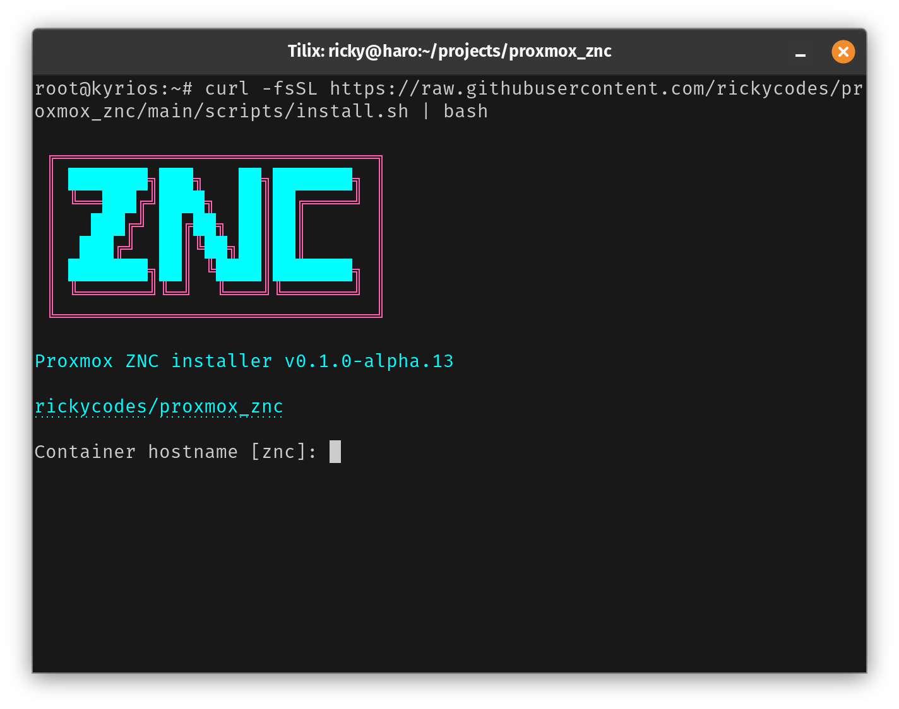
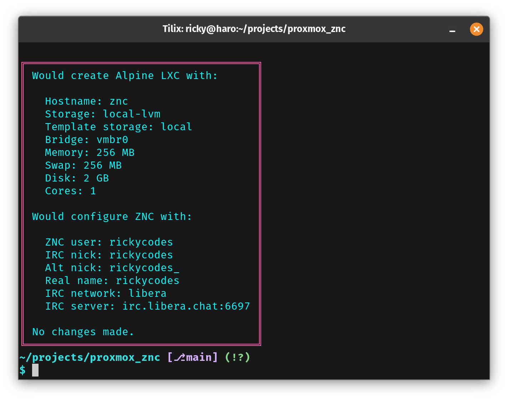

# Proxmox ZNC LXC

A small Proxmox host-side installer that creates an Alpine LXC and bootstraps a basic ZNC bounce.

## Defaults

- IRC network: `irc.libera.chat`
- IRC port: `6697`
- ZNC network name: `libera`
- Container bridge: `vmbr0`
- Container RAM: `256 MB`
- Container swap: `256 MB`
- Container disk: `2 GB`
- Container CPU cores: `1`

## What it does

- Downloads the latest Alpine LXC template for the host architecture.
- Creates a small unprivileged container.
- Installs `znc`, `znc-openrc`, and `ca-certificates`.
- Bootstraps a basic ZNC config wired to Libera by default.
- Starts the service and enables it on boot.

## Install

Run it on the Proxmox host as `root`:

```bash
curl -fsSL https://raw.githubusercontent.com/rickycodes/proxmox_znc/main/scripts/install.sh | bash
```



Pass `--dry-run` to preview the planned install:

```bash
curl -fsSL https://raw.githubusercontent.com/rickycodes/proxmox_znc/main/scripts/install.sh | bash -s -- --dry-run
```



Or pass overrides:

```bash
curl -fsSL https://raw.githubusercontent.com/rickycodes/proxmox_znc/main/scripts/install.sh | bash -s -- \
  --hostname znc \
  --nick ricky \
  --znc-user rickyznc \
  --irc-network libera \
  --irc-server irc.libera.chat \
  --bridge vmbr0 \
  --storage local-lvm
```

## Release Flow

Update the version in `Cargo.toml`, commit the bump, tag the release, and push it:

```bash
git commit -am "bump"
git tag v0.1.0-alpha.13
git push origin main
git push origin v0.1.0-alpha.13
```

GitHub Actions will build:
- `proxmox-znc-x86_64`
- `proxmox-znc-aarch64`

and attach them to the release.

## Verification

Locally, the useful checks are:

```bash
cargo check
cargo test
bash -n scripts/install.sh
```

## Install-Time Knobs

- `--hostname`: container hostname
- `--nick`: IRC nick inside the network; also used as the ZNC admin username by default
- `--alt-nick`: fallback nick
- `--znc-user`: ZNC admin username
- `--password`: ZNC password
- `--irc-server`: IRC server hostname
- `--irc-port`: IRC server port
- `--irc-network`: network name used in the ZNC login string
- `--bridge`: Proxmox bridge
- `--storage`: container root disk storage
- `--memory`, `--swap`, `--disk`, `--cores`: container sizing
- `--dry-run`: print the planned container and ZNC settings, then exit

When you run the Rust installer interactively, it detects active Proxmox storages and lets you pick one for the root disk and template storage instead of forcing a hardcoded default.

## After Install

- IRC client login format: `<znc-user>/<network>:<password>`
- Default IRC server inside ZNC: `irc.libera.chat:6697`

The installer leaves ZNC’s generated config mostly alone. If you want to tune modules, listeners, or auth later, do that in ZNC itself after install.
